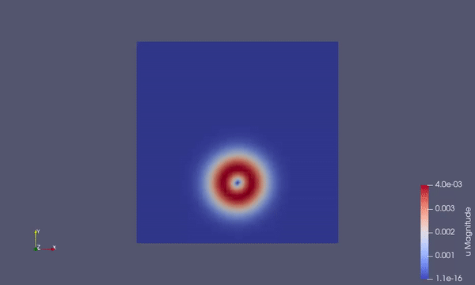

# Shallow Water Equations Solver

This is a repository for a shallow water equations solver written in Julia. 

## Group members 

|  | Name | Email |
|---|---|---|
|  |   Rafał Beres   | R.Beres-1@student.tudelft.nl |
|  |   Yue Chen | Y.Chen-72@student.tudelft.nl |
|  |   Jurgen de Groot   | J.J.deGroot-4@student.tudelft.nl |
|  |   Boyan Kolev  | B.I.Kolev@student.tudelft.nl |
|  |   Bernd Rijn   | Rijn@student.tudelft.nl |

